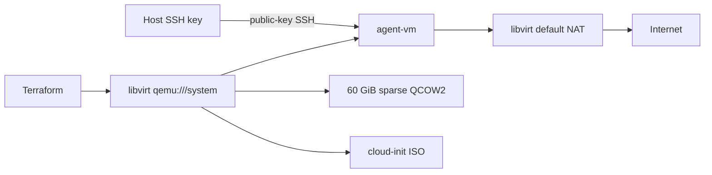

# Terraform VM

Terraform configuration for a hardened Ubuntu 26.04 LTS virtual machine on
KVM/libvirt. The default deployment creates `agent-vm` with 2 vCPUs, 4 GiB of
memory, a sparse 60 GiB QCOW2 disk, key-only SSH, passwordless sudo, libvirt NAT
networking, and host-boot autostart.

## Architecture



## Defaults

| Setting | Default |
| --- | --- |
| VM and hostname | `agent-vm` |
| Operating system | Ubuntu Server 26.04 LTS, AMD64 |
| vCPUs | 2 |
| Memory | 4096 MiB |
| Virtual disk | 60 GiB, sparse QCOW2 |
| Storage pool | `default` |
| Network | `default` libvirt NAT network |
| MAC address | `52:54:00:d6:e8:16` |
| Guest user | `ubuntu` |
| SSH public key | `~/.ssh/id_rsa.pub` |
| Autostart | Enabled |

All defaults can be overridden with Terraform variables. See
[`variables.tf`](variables.tf) for the complete interface.

## Prerequisites

- A Linux host with KVM and libvirt installed and running.
- Terraform 1.6 or newer.
- Access to the system libvirt connection at `qemu:///system`.
- Existing libvirt storage pool and NAT network named `default`, or matching
  overrides for `storage_pool` and `network_name`.
- An SSH public key at `~/.ssh/id_rsa.pub`, or an override through
  `ssh_public_key_path` or `ssh_public_key`.

Verify the expected libvirt resources before applying:

```zsh
virsh --connect qemu:///system pool-info default
virsh --connect qemu:///system net-info default
```

## Deploy

```zsh
terraform init
terraform fmt -check
terraform validate
terraform plan
terraform apply
```

Terraform waits for a DHCP lease and returns the domain name, IPv4 address, and
a strict key-only SSH command:

```zsh
terraform output
terraform output -raw ssh_command
```

Review the generated command, then copy and run it. It can also be evaluated
directly after review:

```zsh
terraform output -raw ssh_command
eval "$(terraform output -raw ssh_command)"
```

## SSH alias

Get the current guest address:

```zsh
terraform output -raw ipv4_address
```

Add the following entry to `~/.ssh/config`, replacing `<guest-ip>` with that
output:

```sshconfig
Host agent-vm
    HostName <guest-ip>
    User ubuntu
    IdentityFile ~/.ssh/id_rsa
    IdentitiesOnly yes
    PreferredAuthentications publickey
    PasswordAuthentication no
    KbdInteractiveAuthentication no
    HostKeyAlias agent-vm
```

Then connect with:

```zsh
ssh agent-vm
```

`HostKeyAlias` keeps this VM's host key separate from other guests that may
later reuse the same private DHCP address.

## Security behavior

Cloud-init configures the `ubuntu` account with:

- Public-key SSH authentication only.
- Password and keyboard-interactive SSH authentication disabled.
- Root SSH login disabled.
- A locked account password.
- Passwordless sudo.
- Fresh SSH host keys on first boot.

The SSH public key is stored in Terraform state as part of the rendered
cloud-init data. Private keys are never read by Terraform. State files and
variable files are excluded by [`.gitignore`](.gitignore); use an encrypted
remote backend if state must be shared.

## Verify the guest

```zsh
ssh agent-vm 'hostname'
ssh agent-vm '. /etc/os-release; echo "$PRETTY_NAME"'
ssh agent-vm 'nproc && free -h && lsblk && df -hT /'
ssh agent-vm 'sudo -n id -u'
ssh agent-vm 'ping -c 3 1.1.1.1'
ssh agent-vm 'getent ahostsv4 ubuntu.com | head -1'
ssh agent-vm 'curl --fail --silent --show-error --head https://ubuntu.com/'
```

Expected security checks:

```zsh
ssh agent-vm 'sudo -n sshd -T | grep -E "^(permitrootlogin|pubkeyauthentication|passwordauthentication|kbdinteractiveauthentication|authenticationmethods) "'
```

## Disk resizing

The pinned libvirt provider treats a configured volume-size change as a disk
replacement. Always inspect `terraform plan`; do not apply a plan that replaces
an existing disk unless data loss is intentional.

For an existing running VM, expand the disk through libvirt first, grow the
guest partition and filesystem, and then confirm Terraform has no drift. For
example, to expand to 60 GiB:

```zsh
virsh --connect qemu:///system blockresize agent-vm vda 60G
ssh agent-vm 'sudo -n growpart /dev/vda 1 && sudo -n resize2fs /dev/vda1'
terraform plan
```

QCOW2 remains sparse: a 60 GiB virtual capacity does not immediately consume
60 GiB on the host, but host usage grows as the guest writes data.

## Operations

Inspect the VM and its network:

```zsh
virsh --connect qemu:///system dominfo agent-vm
virsh --connect qemu:///system domifaddr agent-vm --source lease
virsh --connect qemu:///system net-info default
```

Gracefully stop or start the VM:

```zsh
virsh --connect qemu:///system shutdown agent-vm
virsh --connect qemu:///system start agent-vm
```

The domain and `default` network are configured to start automatically with
libvirt when the host boots.

## Destroy

```zsh
terraform plan -destroy
terraform destroy
```

Destroying the deployment permanently removes the VM, its QCOW2 disk, and its
cloud-init ISO. Back up any required guest data first.

## Repository checks

Run these before committing:

```zsh
terraform fmt -check
terraform validate
terraform plan -detailed-exitcode
gitleaks dir . --no-banner --redact
gitleaks git . --no-banner --redact
```
